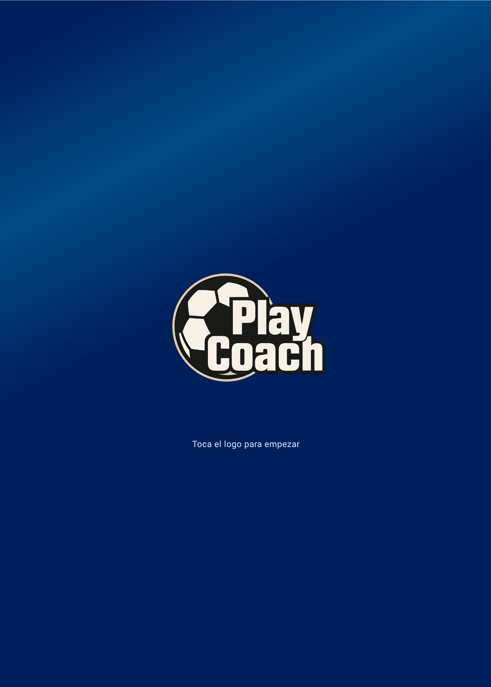
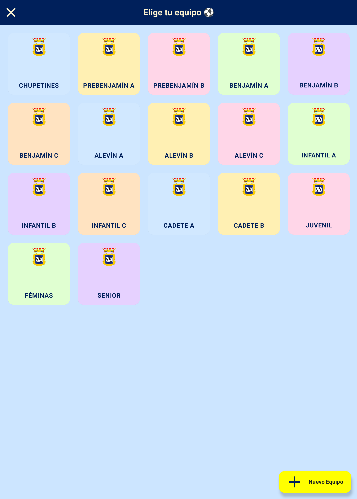
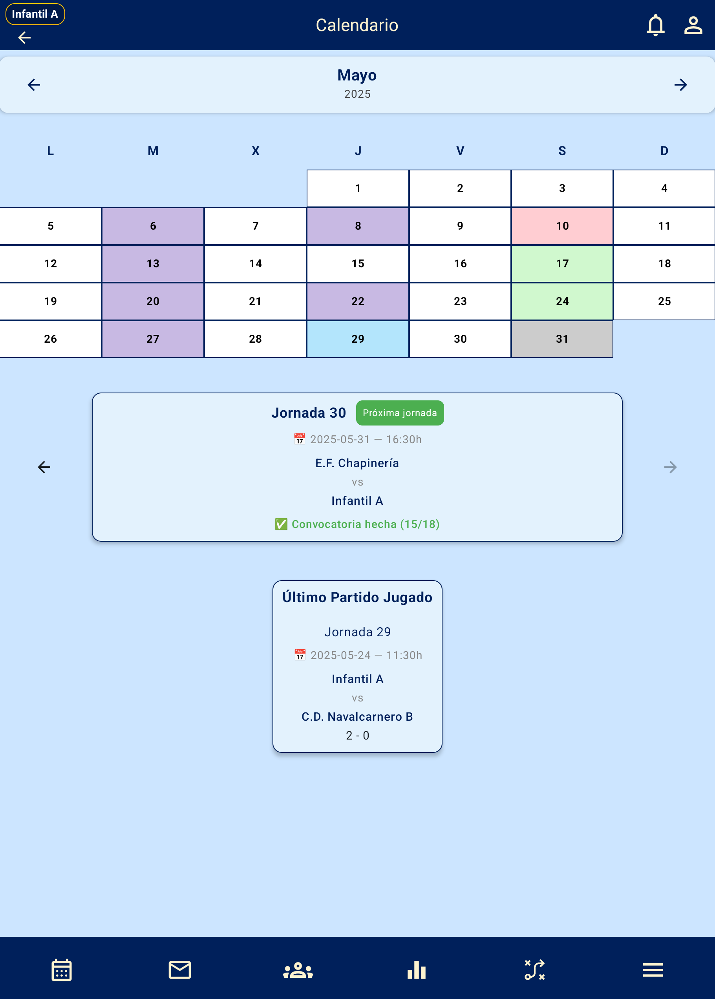
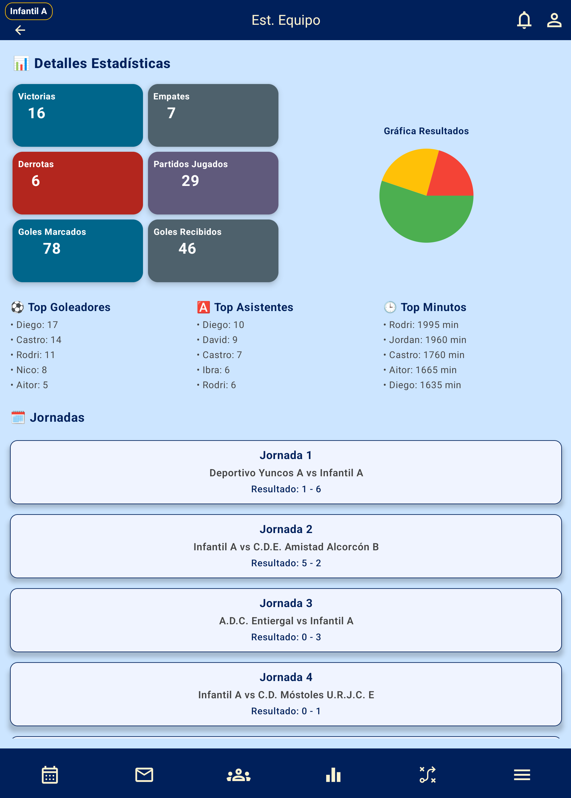
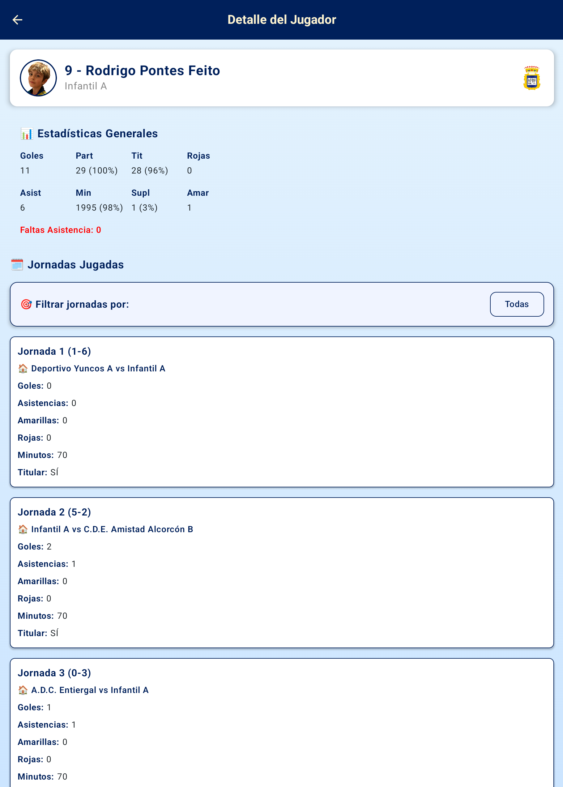
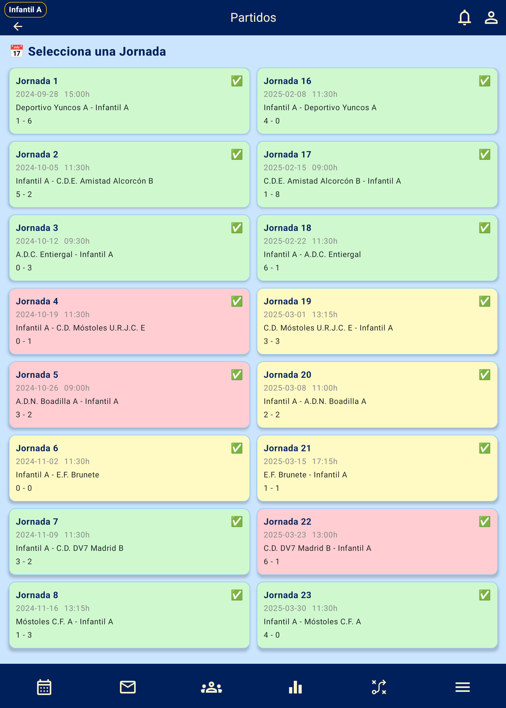
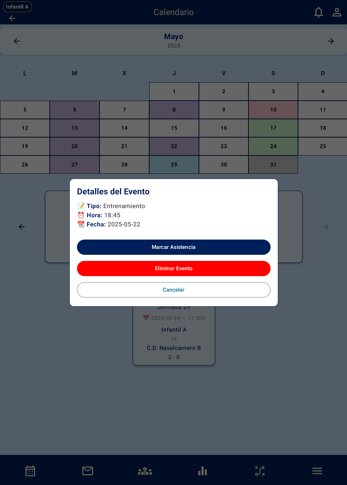
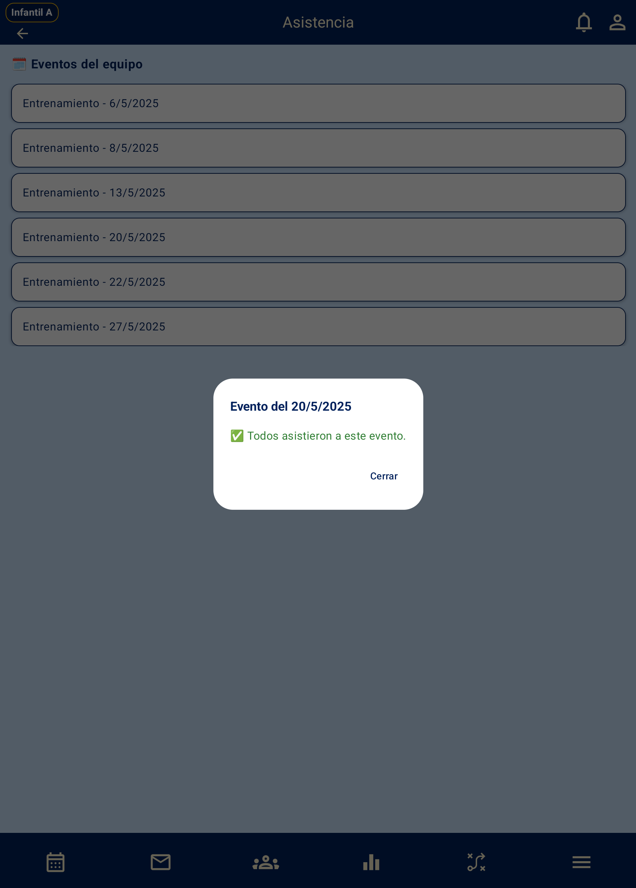
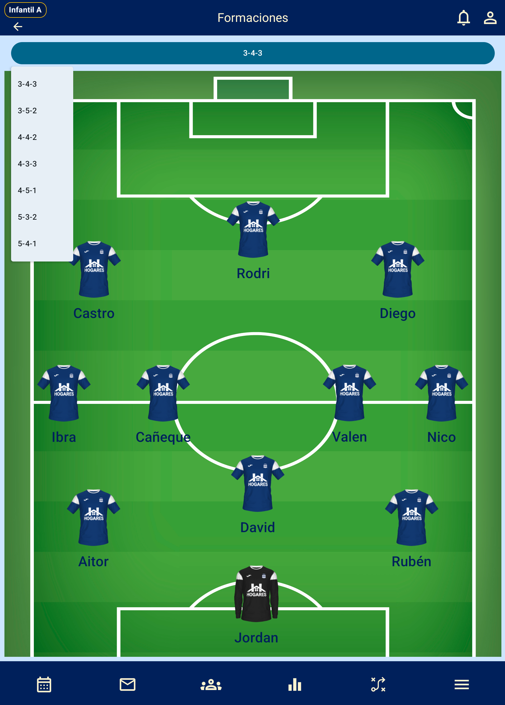

# PlayCoach ⚽📱

An Android application developed in Kotlin with Jetpack Compose, focused on youth football team management. Designed with a modern MVVM architecture and persistence using Room.

---

## 🚀 Technologies & Architecture

- **Kotlin + Jetpack Compose**
- **Layered MVVM architecture (Room → Repository → ViewModel → UI Compose)**
- **StateFlow and viewModelScope for reactive state management**
- **Navigation with Navigation Compose + parameterized routes**
- **Dependency injection with Hilt**
- **Material Design 3**
- **Persistence with Room and custom DAOs**

---

## 🧠 Main Features

- Management of players, coaches, and teams
- Creation and editing of matchdays
- Attendance tracking and match call-ups
- Player and team statistics
- Calendar view with events and matches
- Tactical formation editor
- Detailed view per matchday and player

---

## 🎥 Screenshots

| Splash Screen                     | Team Selection	                    | Calendar View                          |
|-----------------------------------|------------------------------------|-------------------------------------|
|    |  |  |

| Team Stats                               | Player Stats                                  | Jornadas                             |
|------------------------------------------|-----------------------------------------------|--------------------------------------|
|  |  |  |

| Events Detail                        | Attendance                              | Tactical Board                          |
|--------------------------------------|-----------------------------------------|-----------------------------------------|
|  |  |  |
---

## 🏁 Getting Started

```bash
git clone https://github.com/TuUsuario/PlayCoach.git
---
